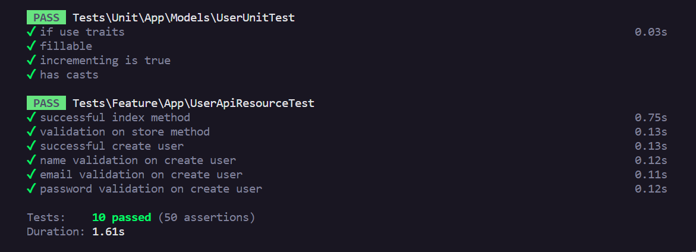
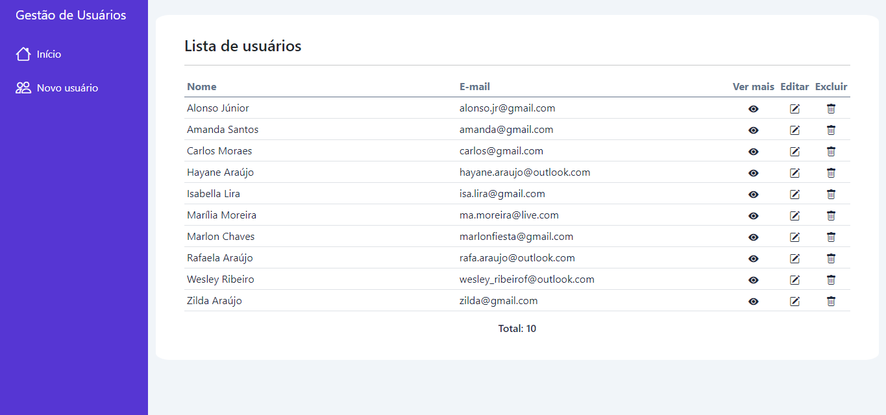
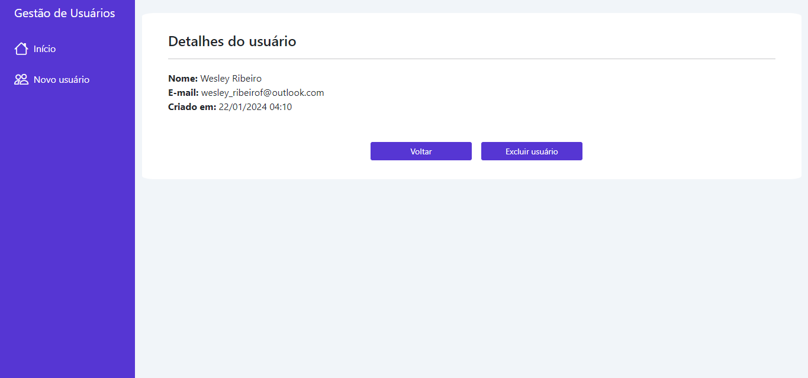
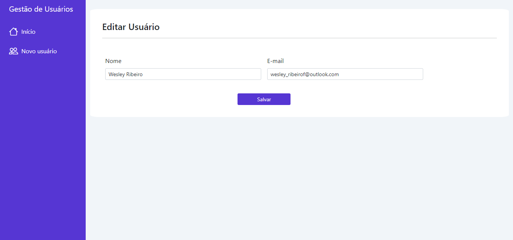
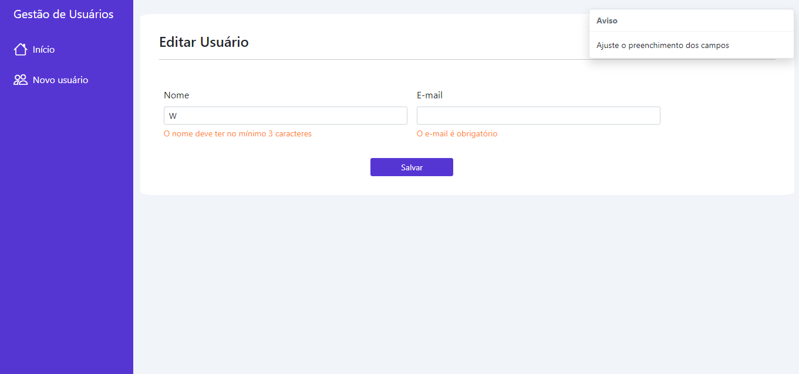
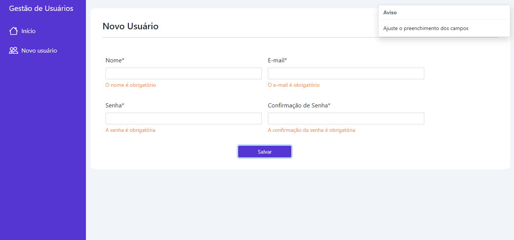
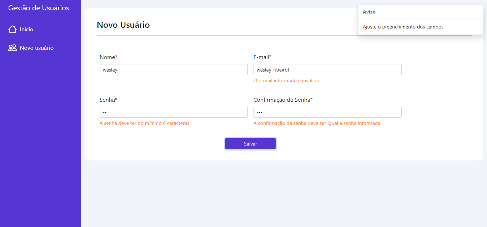

# App Users
  

O projeto envolve operações de CRUD de usuários em laravel. Para isso, criou-se uma API REST, com as melhores práticas, bem como templates *blade* no *front-end* para consumir a mesma.

## Como usar
**1** - Faça um clone do repositório para sua máquina

    git clone https://github.com/wesley-rfa/app_users.git
**2** - Execute o comando expo start

    php artisan serve
    
## API REST
Foi desenvolvida uma API REST seguindo as melhores práticas do laravel no contexto do projeto. Seguem alguns recursos utilizados:

### ApiResource
Seguindo o que recomenda a documentação do *framework*, foi seguido a padronização de métodos de recursos nos controladores (*index*, *show*, *store*, *update* e *destroy*), por isso a rota de api foi declarada também utilizando esse recurso.
### Repository Pattern
Utilização do *repository pattern* para separação da lógica e melhor distribuição de responsabilidades, promovendo um isolamento da camada de acesso aos dados. Portanto, todas as operações sobre os usuários estão em seu respectivo repositório.
### Form Request
A fim de aplicar as melhores práticas de validações do laravel, foi utilizado a classe que encapsula a lógica de validação e autorização do *framework*, o *form request*.

Nesse contexto, tem-se uma classe para validação da criação de usuário (*store method*) e outra para atualização do usuário (*update method*). Ambas possuem a padronização de mensagens de erros de validação.

### Padronização do *Response*
Implementação de uma classe responsável por padronizar o *response* da API com a seguinte estrutura:

**1** - Campo  **success** é um booleano que indica ao *client* se a operação obteve sucesso ou não.

**2** - Campo  **data** que contêm os dados retornados pela API.

**3** - Campo  **meta** que contêm o campo **apiVersion** com a versão atual da API.

Além disso, o *status code* retornado segue o padrão do HTTP.

### Tratamento de erros e gravação de Logs
Para melhor informar ao *client* os erros ocorridos, a API segue a seguinte padronização, que é retornada dentro do campo **data**.

**1** - Campo  **errorCode**: Código de erro padronizado pela aplicação através de um *Enum*. É um número inteiro que serve para o *front-end* entender qual tipo de erro retornado.

**2** - Campo  **errorMessage**: Contêm a mensagem principal a ser exibida para o usuário em tela.

**3** - Campo  **errorList**: Lista com todos os erros encontrados. No caso de erro de validação, é aqui que serão retornados as mensagens de cada campo.

Além disso, a gravação de log é feita. Para isso, foram criados canais de logs para os controladores e para o sistema como um todo. Dessa forma, é possível ter a rastreabilidade dos erros.

## Migrations e Model
Feita modificação na migration de *users*, gerada ao iniciar um projeto em laravel, adicionando o *softDeletes* para a criação da coluna *deleted_at*, sendo possível a exclusão lógica dos usuários. 

Dessa forma, a model *User*, também gerada de forma padrão ao iniciar o projeto, foi modificada.

## Front-end
Para o *front-end* foi utilizado o *blade* nas *views* e explorados tópicos interessantes nesse contexto, como o reaproveitamento de código *html* ao usar as diretivas *@yield*, *@include*, *@extends* e *@section*.

As requisições a *API* foram feitas via **JavaScript** através do **AJAX**, utilizando o **JQuery**.

Além disso, para melhor estilização o **Bootstrap** também foi usado.

## Testes
Foi utilizado o PHPUnit, que já vem integrado ao laravel. No total tem-se 10 testes (4 unitários e 6 de integração).

### Testes Unitários
Testes realizados sobre a *model User*

**1** - Verifica as *traits* utilizadas

**2** - Verifica o conteúdo do atributo *fillable*

**3** - Verifica se o atributo de incremento é verdadeiro

**4** - Verifica os *casts* presentes

### Testes de Integração
Testes realizados sobre a API desenvolvida

**1** - Verifica o retorno da listagem de usuários

**2** - Verifica, para todos os campos, a validação feita ao salvar um usuário

**3** - Verifica se o usuário está sendo salvo com sucesso

**4** - Verifica a validação de nome

**5** - Verifica a validação de e-mail

**6** - Verifica a validação de senha

### Exemplos
Seguem imagens da interface desenvolvida. Tem-se um menu de navegação lateral fixo.

## Listagem
Listagem com ações de ver detalhes, editar e excluir.

## Detalhes do usuário

## Edição do usuário

## Validação na criação de usuário

